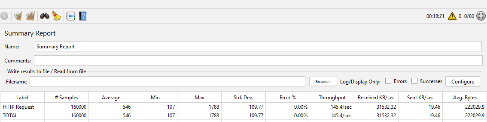
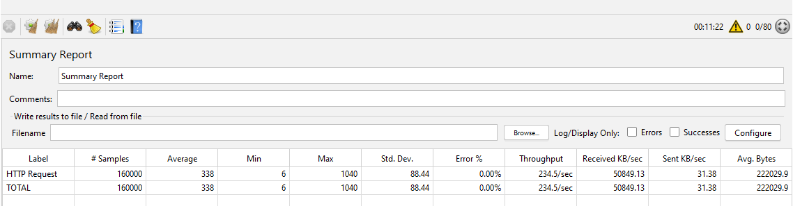
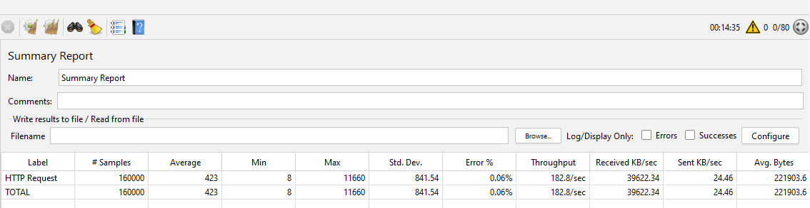
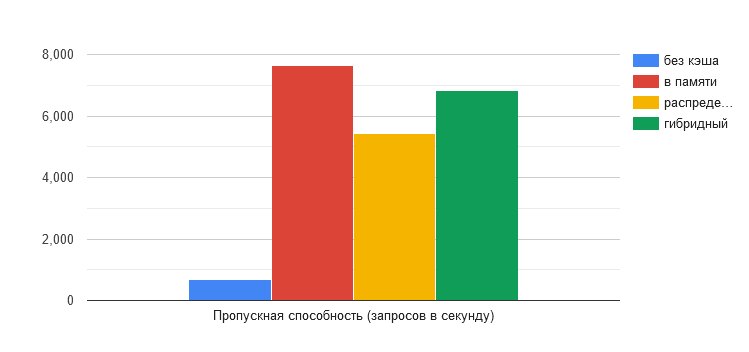
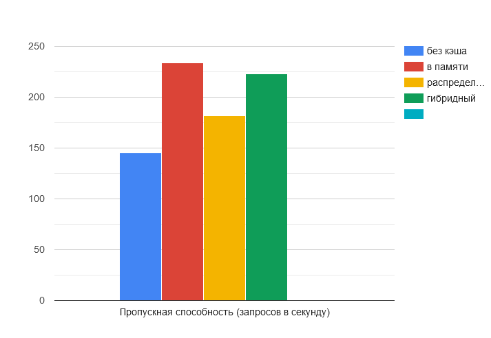
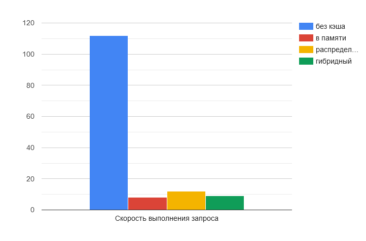
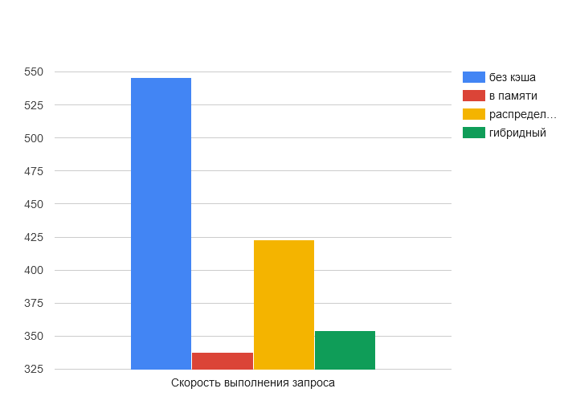

# Введение
В справочных материалах по теме кэширования обычно указывается какой тип кэширования быстрее или предпочтительнее в разных случаях. Однако вам может быть полезно наглядно в этом убедится и опираясь на цифры принимать осознанное решение о применении того или инного типа кэша.

В данном материале представлены реализации разных типов кэшэй а также проведен тест каждой из реализаций используя jMeter. Для каждой из реализаций предусмотрено два сценария: с маленьким обьектом (~0.2KB) и большим обьектом (~200KB).

Для самостоятельного проведения теста вам необходимо открыть консоль в папке с проектом реализации ([например](../src/Demos/NoCacheApi)) и выполнить команду `docker compose up`. После чего открыть в jMeter файл [Test_Plan.jmx](../src/Test_Plan.jmx) и запустить тестовый сценарий. Для проведения теста для сценария с большим обьектом необходимо выбрать для jMeter файл [Test_Plan_Large_Objects.jmx](../src/Test_Plan_Large_Objects.jmx).

Для того чтобы более детально рассмотреть сколько времени занимает сериализация/десериализация в конце материала приведены данные бенчмарков, исходный код которых можна найти в папке [Benchmarks](../src/Benchmarks).

Также в конце материала приведена сравнительная таблица производительности в процентах от сценария без кэширования.

# Тестовый сценарий
- Для проведения теста оба сценария jMeter были сконфигурированы чтобы симулировать 160 000 запросов из 80 потоков.
- Для кэша выставлен AbsoluteExpirationTime в 10 секунд.
- Эмуляция запроса к источнику данных занимает 100 миллисекунд (приблизительно эквивалентно запросу к базе данных).
- Приложение расположено по адресу `http://localhost:42685` (для распределенного и гибридного кэша присутствует также второй экземпляр на порту :42686 с целью проверки целостности кэша) и принимает запросы по адресу `[GET]api/v1/data`. Запрос на инвалидацию кэша: `[POST]api/v1/data`.

# Тестирование с маленьким обьектом
## Нет кэширования
Контрольный тест чтобы получить исходные данные. Приложение без использования кэша эмулирует запрос к базе данных общей длительностью 100 миллисекунд.

Среднее выполнение запроса ожидаемо больше 100 миллисекунд. Для выполнения тестового сценария потребовалось 3 минуты 51 секунда, со средней пропускной способностью в 690 запросов в секунду.

## Кэширование в памяти
Тест с использованием кэширования в памяти является самым производительным из рассматриваемых вариантов.

При использовании кэширования в памяти среднее время выполнения запроса составило около 8 миллисекунд (что по сути состоит из накладных расходов создаваемых ASP NET Core). Для выполнения тестового сценария потребовалось 20 секунд со средней пропускной способностью в 7655 запросов в секунду.

## Распределенное кэширование
Рассматривая результаты тестирования распределенного кэша следует учитывать что тестовая среда (docker compose) имеет минимальныо возможные накладные расходы на передачу запросов в сети, так как и Redis и приложение находятся на одной машине. В реальной среде накладные расходы скорее всего будут выше.

При использовании распределенного кэширования среднее время выполнения запроса составило около 12 миллисекунд, что незначительно больше результатов тестирования в памяти (следует учитывать идеальные условия тестирования). Для выполнения тестового сценария потребовалось 29 секунд со средней пропускной способностью в 5438 запросов в секунду. Можно сделать вывод что в идеальных условиях использование Redis уступает в производительности кэшированию в памяти почти в полтора раза (7655/5438=1.407). 

## Гибридное кэширование
Использование гибридного кэша ожидаемо оказалось более производительным чем распределенное кэширование.

При использовании гибридного кэша среднее время выполнения запроса составило около 9 миллисекунд. Для выполнения тестового сценария потребовалось 23 секунды со средней пропускной способностью в 6840 запросов в секунду.

# Тестирование с большим обьектом
## Нет кэширования
Контрольный тест чтобы получить исходные данные. Приложение без использования кэша эмулирует запрос к базе данных общей длительностью 100 миллисекунд. Время выполнения запроса также будет включать в себя дополнительные расходы на сериализацию данных и перемещению их по сети.

Среднее выполнение запроса около 546 миллисекунд. Для выполнения тестового сценария потребовалось 18 минут 21 секунда, со средней пропускной способностью в 145 запросов в секунду.

## Кэширование в памяти
Тест с использованием кэширования в памяти является самым производительным из рассматриваемых вариантов.

При использовании кэширования в памяти среднее время выполнения запроса составило 338 миллисекунд, что в сравнении с данными из сценария с маленьким обьектом (8 миллисекунд) дает нам представление о дополнительных расходах на сериализацию и транспортировку. Для выполнения тестового сценария потребовалось 11 минут 22 секунды со средней пропускной способностью в 234 запросов в секунду.

## Распределенное кэширование
Рассматривая результаты тестирования распределенного кэша следует учитывать что тестовая среда (docker compose) имеет минимальныо возможные накладные расходы на передачу запросов в сети, так как и Redis и приложение находятся на одной машине. В реальной среде накладные расходы на транспортировку больших обьектов скорее всего будут выше. В реальных сценариях для минимизации транспортных расходов обычно применяется сжатие перед отправкой.

При использовании распределенного кэширования среднее время выполнения запроса составило 423 миллисекунды. Для выполнения тестового сценария потребовалось 14 минут 35 секунд со средней пропускной способностью в 182 запроса в секунду. Распределенный кэш в сценарии с большим обьектом показал выигрыш производительности приблизительно в 23% относительно приложения без кэша, что показывает что при использовании больших обьектов эффективность распределенного кэша сильно снижается.

## Гибридное кэширование
Использование гибридного кэша ожидаемо оказалось более производительным чем распределенное кэширование. Как и в сценарии с маленьким обьектом, гибридное кэширование лишь немного уступает кэшированию в памяти.

При использовании гибридного кэша среднее время выполнения запроса составило 354 миллисекунд. Для выполнения тестового сценария потребовалось 11 минут 57 секунд со средней пропускной способностью в 223 запросов в секунду.

# Сравнительная таблица
| Пропускная способность (запросов в секунду) | без кэша | в памяти | распределенный | гибридный |
|---------------------------------------------|----------|----------|----------------|-----------|
| Маленький обьект                            | 690      | 7655     | 5438           | 6840      |
| Большой обьект                              | 145      | 234      | 182            | 223       |

| Среднее время выполнения запроса | без кэша | в памяти | распределенный | гибридный |
|----------------------------------|----------|----------|----------------|-----------|
| Маленький обьект                 | 112      | 8        | 12             | 9         |
| Большой обьект                   | 546      | 338      | 423            | 354       |

# Результаты бенчмарков

|              Method |     Mean |   Error |  StdDev |
|-------------------- |---------:|--------:|--------:|
|      CreateDataItem | 109.9 ms | 1.61 ms | 1.85 ms |
| CreateLargeDataItem | 115.5 ms | 3.93 ms | 4.53 ms |

|           Method |           Mean |        Error |       StdDev |
|----------------- |---------------:|-------------:|-------------:|
|        Serialize |       582.9 ns |      6.68 ns |      7.69 ns |
|      Deserialize |       869.7 ns |     13.91 ns |     14.89 ns |
|   SerializeLarge | 1,346,152.9 ns |  4,914.18 ns |  5,258.12 ns |
| DeserializeLarge | 1,850,918.3 ns | 15,147.79 ns | 17,444.21 ns |