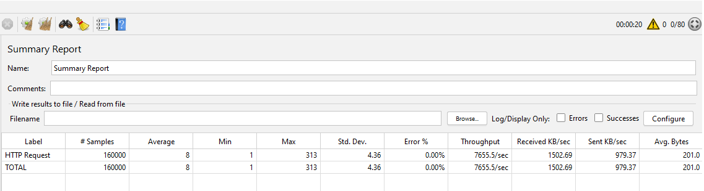
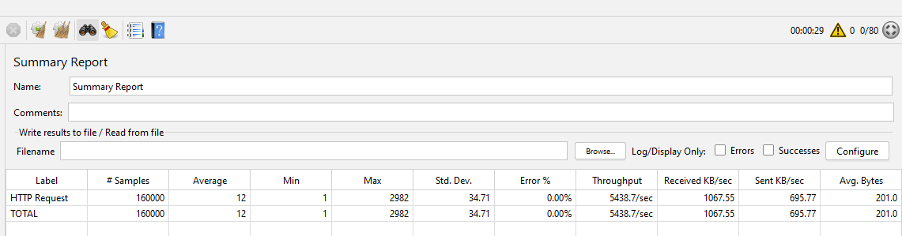
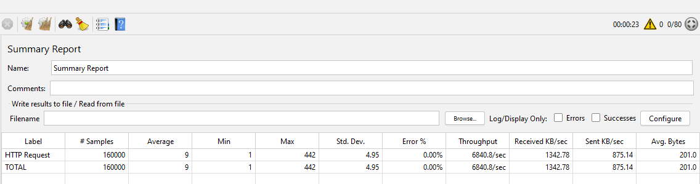

# Введение
В справочных материалах по теме кэширования обычно указывается какой тип кэширования быстрее или предпочтительнее в разных случаях. Однако вам может быть полезно наглядно в этом убедится и опираясь на цифры принимать осознанное решение о применении того или инного типа кэша.

В данном материале представлены реализации разных типов кэшэй а также проведен тест каждой из реализаций используя jMeter.

Для самостоятельного проведения теста вам необходимо открыть консоль в папке с проектом реализации ([например](../src/Demos/NoCacheApi)) и выполнить команду `docker compose up`. После чего открыть в jMeter файл [Test_Plan.jmx](../src/Test_Plan.jmx) и запустить тестовый сценарий.

# Тестовый сценарий
- Для проведения теста jMeter был сконфигурирован чтобы симулировать 160 000 запросов из 80 потоков.
- Для кэша выставлен AbsoluteExpirationTime в 10 секунд.
- Эмуляция запроса к источнику данных занимает 100 миллисекунд (приблизительно эквивалентно запросу к базе данных).
- Приложение расположено по адресу `http://localhost:42685` (для распределенного и гибридного кэша присутствует также второй экземпляр на порту :42686 с целью проверки целостности кэша) и принимает запросы по адресу `[GET]api/v1/data`. Запрос на инвалидацию кэша: `[POST]api/v1/data`.

# Тестирование
## Нет кэширования
Контрольный тест чтобы получить исходные данные. Приложение без использования кэша эмулирует запрос к базе данных общей длительностью 100 миллисекунд.

Среднее выполнение запроса ожидаемо больше 100 миллисекунд. Для выполнения тестового сценария потребовалось 3 минуты 51 секунда, со средней пропускной способностью в 690 запросов в секунду.

## Кэширование в памяти
Тест с использованием кэширования в памяти является самым производительным из рассматриваемых вариантов.

При использовании кэширования в памяти среднее время выполнения запроса составило около 8 миллисекунд (что по сути состоит из накладных расходов создаваемых ASP NET Core). Для выполнения тестового сценария потребовалось 20 секунд со средней пропускной способностью в 7655 запросов в секунду.

## Распределенное кэширование
Рассматривая результаты тестирования распределенного кэша следует учитывать что тестовая среда (docker compose) имеет минимальныо возможные накладные расходы на передачу запросов в сети, так как и Redis и приложение находятся на одной машине. В реальной среде накладные расходы скорее всего будут выше.

При использовании распределенного кэширования среднее время выполнения запроса составило около 12 миллисекунд, что незначительно больше результатов тестирования в памяти (следует учитывать идеальные условия тестирования). Для выполнения тестового сценария потребовалось 29 секунд со средней пропускной способностью в 5438 запросов в секунду. Можно сделать вывод что в идеальных условиях использование Redis уступает в производительности кэшированию в памяти почти в полтора раза (7655/5438=1.407). 

## Гибридное кэширование
Использование гибридного кэша ожидаемо оказалось более производительным чем распределенное кэширование.

При использовании гибридного кэша среднее время выполнения запроса составило около 9 миллисекунд. Для выполнения тестового сценария потребовалось 23 секунды со средней пропускной способностью в 6840 запросов в секунду.
