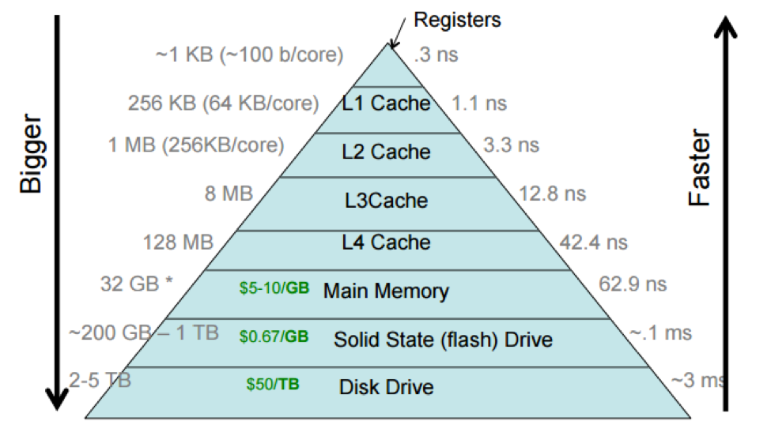
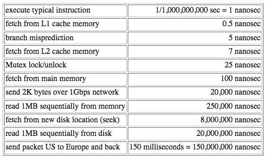
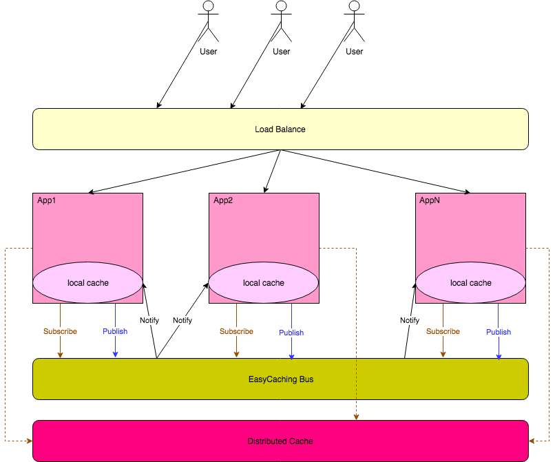

# Введение
Производительность веб-приложения, или же его способность справляться с возрастающим потоком пользователей без ухудшения пользовательского опыта, одно из самых выжных свойств для современных высоконагруженных распределенных систем. Для достижения высокой производительности применяются несколько инструментов, среди которых особую роль играет кэширование.

# Что такое кэширование ?
Для того чтобы ответить на этот вопрос нужно представить средний путь выполнения интернет запроса. Через какие этапы проходит интернет запрос:
1. Клиент приложения в браузере или на мобильном устройстве отправляет запрос
2. Запрос проходит через несколько промежуточных сетевых интерфейсов (router, DNS, firewall, gateways etc) прежде чем попадает к серверу, которому предназначается запрос
3. Сервер, который принимает запрос, должен его обработать. Для обработки запроса серверу необходимо:

    3.1. обратится к источнику данных

    3.2. произвести вычисления

    3.3. сформировать ответ

    3.4. отправить его
4. Ответ на запрос проходит обратно через сетевые интерфейсы на клиентское устройство

Прохождение запроса через промежуточные интерфейсы заниманиет определенное время (в особенности, если сервер находится на другой стороне планеты), а его полная обработка занимает вычислительные мощности сервера. Система имеет определенный предел потока пользователей (или количества запросов в единицу времени), после которого дальнейшее увеличение этого потока приведет к замедлению обработки, ухудшению пользовательского опыта, или к полной неработоспособности приложения. Что же можно сделать чтобы отодвинуть этот предел ?
Если проанализировать запросы приложения, можно обнаружить следующее:
- некоторые запросы могут повторяться довольно часто, но при этом ответ на эти запросы будет оставатся одинаковым в течении продолжительного времени
- в ответ на некоторые запросы возвращаются статичные данные, которые не изменяются за время жизни приложения (html, css, javascript)
- для ответа на некоторые запросы сервер запрашивает одни и те же данные из медлительного источника
- для ответа на некоторые запросы сервер выполняет затратные вычисления с одними и теми же вводными, которые возвращают один и тот же результат

Иными словами есть множество ситуаций, когда запрос к медлительному источнику данных, затратное вычисление или запрос на сервер на другом континенте можно на определенное время заменить сохранением данных, полученных от предыдущего запроса, ближе к конечному потребителю этих данных. Этот процесс называется кэшированием.

[Кэш](https://ru.wikipedia.org/wiki/%D0%9A%D1%8D%D1%88) — промежуточный буфер с быстрым доступом к нему, содержащий информацию, которая может быть запрошена с наибольшей вероятностью. Доступ к данным в кэше осуществляется быстрее, чем выборка исходных данных из более медленной памяти или удалённого источника.

Для иллюстрации разных уровней кэширования а также сравнения скорости доступа к ним служат следующик изображения:

# Типы кэширования в вэб приложениях
В наших примерах мы будем рассматривать типы кэширования, которые используются в вэб приложениях, а именно:
- Кэширование в памяти (In-memory cache)
- Распределенное кэширование (distributed cache)
- (Распределенный) гибридный кэш (distributed hybrid cache)

## Кэширование в памяти
Множество веб приложений имеют монолитную архитектуру (приложение существует в единственном экземпляре и не распределено на несколько серверов), и поэтому могут использовать самый быстрый тип кэширования - кэширование в памяти. Кэширование в памяти не требует дополнительных зависимостей, часто не требует использования сторонних библиотек, позволяет хранить целые обьекты (без сериализации/десериализации) и имеет наивысшую скорость доступа (доступ происходит в рамках памяти приложения).

## Распределенное кэширование
Если приложение имеет распределенную архитектуру (существует один или больше экземпляров приложения, расположенных на разных серверах), то на механизм кэширования накладывается ряд ограничений. Кэш должен быть согласован между экземплярами и иметь механизм инвалидации, чтобы экземпляры приложения всегда использовали актуальные данные. Для удовлетворения этих требований приложения используют сторонний сервис, который обычно расположен в пределах той же подсети для уменьшения задержек передачи данных по сети, который оптимизирован для быстрого сохранения и возвращения данных. Распределенный кэш используется для более быстрого доступа к данным, которые обычно извлекаются из медленных или сильно удаленных источников, а также для сохранения результатов затратных вычислений, что делает их доступными для других экземпляров. Пример такого сервиса - Redis, котрый мы будем использовать в наших примерах. 

## Гибридное кэширование
Распределенный кэш хоть и значительно повышает производительность и надежность приложения, все же имеет недостатки в виде задержки при обращении к нему по сети. Также сервисы распределенного кэша (Redis) имеют свой предел количества запросов в единицу времени, после чего начинают деградировать. Чтобы сделать систему более производительной и обойти ограниченияраспределенного кэша, используется комбинированный или гибридный подход, при котором данные сохраняются в распределенный кэш, откуда сохраняются в кэш в памяти каждого экземпляра. Таким образом значительно повышается скорость доступа к данным. Однако для инмлементации гибридного кэширования необходимо предусмотреть механизм инвалидации, который бы сообщал экземплярам о том что их кэш в памяти больше не валиден и должен быть обновлен из централизованного распределенного кэша. Для решения данной проблемы используются шины данных или системы publish/subscribe, напрмиер RabbitMq, AzureSerivceBus, или Redis channels. Стоит учитывать что введение гибридного кэширования может усложнить вашу систему (а также вызвать обморок и истерические припадки у особо нежных коллег).

Схема гибридного кэширования:

Дополнительные источники:
- [Microsoft. Best Practices: Caching](https://docs.microsoft.com/en-us/azure/architecture/best-practices/caching)
- [Amazon. Обзор кэширования](https://aws.amazon.com/ru/caching/)